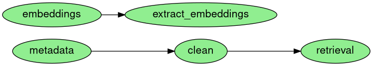

# CovEffect-data-provision
Data provisioning pipeline for GeCo CovEffect's project



## Output files for production:
| Path | Destination |
|---|---|
| products/production_metadata/metadata.csv | mariadb/production/metadata |
| products/retrieval/index.tar.gz | extract and move indexdir and its content to backend/api/local_data/ |
| products/similar/embeddings.ann | move to backend/api/local_data/annoy/

## Setup

```sh
# Clone this repo
git clone git@github.com:FrInve/CovEffect-data-provision.git
# cd to CovEffect-data-provision
cd CovEffect-data-provision
# Create an environment
python3 -m venv .venv
# activate environment
source .venv/bin/activate
# install dependencies
pip3 install -r requirements.txt
```


## Running the pipeline

```sh
ploomber build
```


